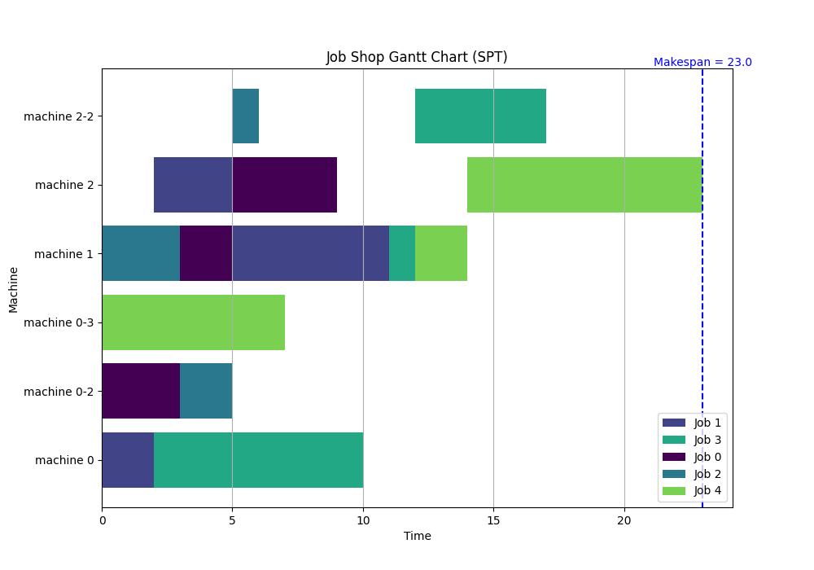

# Job Shop Scheduling Simulator with SimPy

This program is a job shop scheduling simulator implemented in Python using SimPy. The simulator models jobs, machines, and operations and uses a priority scheduling rule (Shortest Processing Time first). 

The simulator can be used to model a job shop environment where multiple jobs are processed by multiple machines, each job has a unique processing order across the machines, and each operation has a specific duration.

## Files

- `simulation.py`: Contains the main simulation code with classes for Job, Source, Machine, Sink, and Monitor.
- `preprocessing.py`: Contains a function for parsing the job-shop scheduling problem instance from a text file.
- `pseudo_store.py`: Contains a pseudo store for storing jobs.
- `visualize.py`: Contains a function for visualizing the scheduling result as a Gantt chart.

## Key Classes

- `Job`: This class represents a job in the job shop. It contains job-specific information, including the machine order and operation times.
- `Source`: This class represents the source of the jobs. It generates jobs and starts their processing.
- `Machine`: This class represents an individual machine. It maintains a queue of jobs to be processed. It handles job processing, tracks machine states, and routes jobs to other machines or the sink after they're processed.
- `Sink`: This class represents the end of the job processing pipeline. It receives finished jobs and marks them as completed.
- `Monitor`: This class keeps track of the simulator's state at different points in time and saves these states to a CSV file.
- `visualize`: This module contains the function `gantt()` which is used to create Gantt charts of the job shop's operation.

## Usage

To use this simulator, you must first provide a text file with the job data. The job data file follows `Standard Specification`, and should specify the number of jobs, the number of machines, and the machine order and operation time for each job. 

Here is an example of the data file format:

```txt
5 3
0 3 1 2 2 4
0 2 2 3 1 6
1 3 0 2 2 1
0 8 1 1 2 5
0 7 1 2 2 9
```

This data file specifies a job shop with 5 jobs and 3 machines. The first job's machine order is 0 -> 1 -> 2, and the operation times on these machines are 3, 2, and 4 respectively.

To run the simulator, execute the `simulation.py` file with the path to the job data file, path to save output files, dispatching rule:
```bash
python simulation.py 'input_filename' 'output_directory' 'dispatching rule'
```
This will run the simulation, save the event log to 'output_directory/eventlog.csv', and then visualize the job shop's operation as a Gantt chart.

The `gantt()` function uses the event log to generate a Gantt chart showing when and on which machine each job was processed. The Gantt chart is displayed using matplotlib and saved as a file as 'path_to_save_output_files/Gantt_Chart.png'.

## Output

The simulation generates a CSV file ('JobShop/output/eventlog.csv') that logs important events. Each row in the CSV file represents an event and contains the following information:

- Time: The time the event occurred.
- Job: The job involved in the event.
- Process: The process (machine) involved in the event.
- Event: The type of the event (e.g., 'operation start', 'operation finish', 'job created', 'job finish').
- Machine: The machine involved in the event.

After running the simulation, the program generates a Gantt chart showing the operation of the job shop. The x-axis represents time, and the y-axis represents machines. Each job is represented by a colored block. The left edge of the block indicates the start time of the job, and the right edge indicates the end time. Different jobs are shown in different colors.



## Dependencies

This simulator uses the following Python libraries:

- SimPy
- Numpy
- Pandas
- Matplotlib
- Plotly
